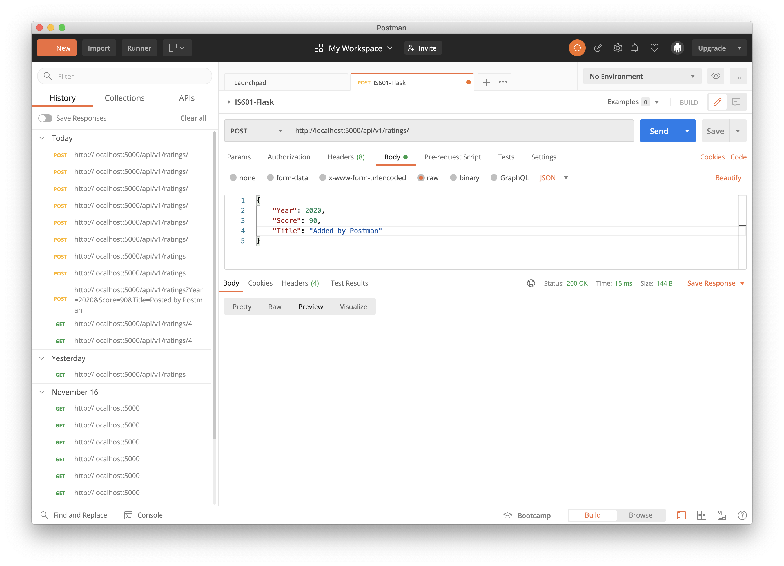

# IS601-PythonDockerFlask

## Project Description

This project is a homework assignment to teach how to get Pycharm setup with Docker, Flask, MySQL, and Postman.

## API: All-records Screenshot

## API: Single record Screenshot

## API: Adding a record

Record list after posted:

## API: Deleting a record

Record list after deleted:

## API: Updating a record

Record list after updated:

