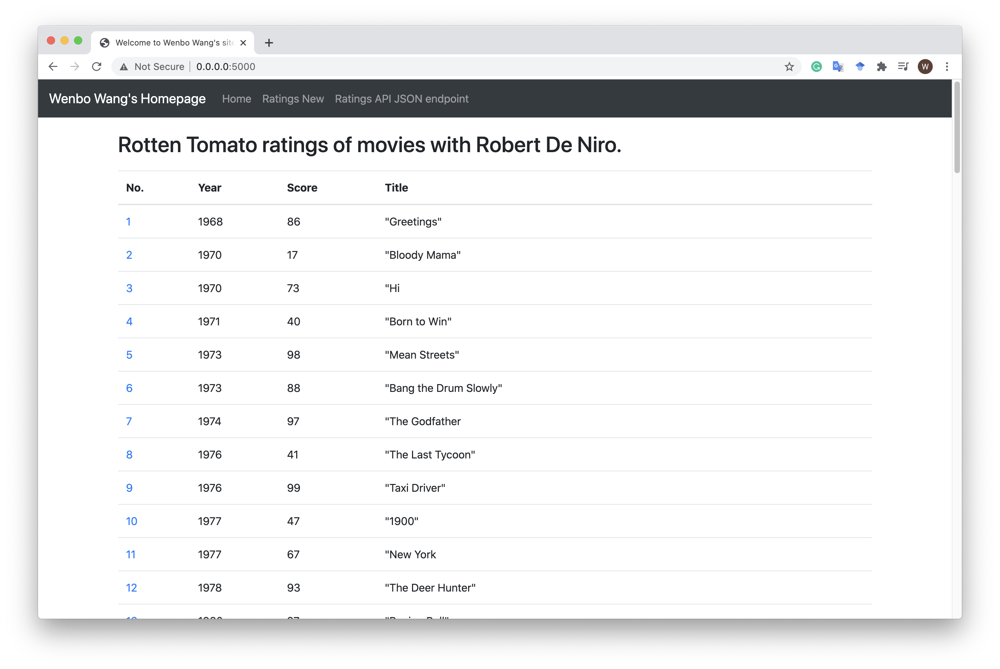

# IS601-PythonDockerFlask

## Project Description

This project is a homework assignment to teach how to get Pycharm setup with Docker, Flask, MySQL, and Postman.

## Postman Screenshot

## Database Manager Screenshot

## Homepage Screenshot

## Adding a record

## Deleting a record

## Updating a record

## Viewing a record

